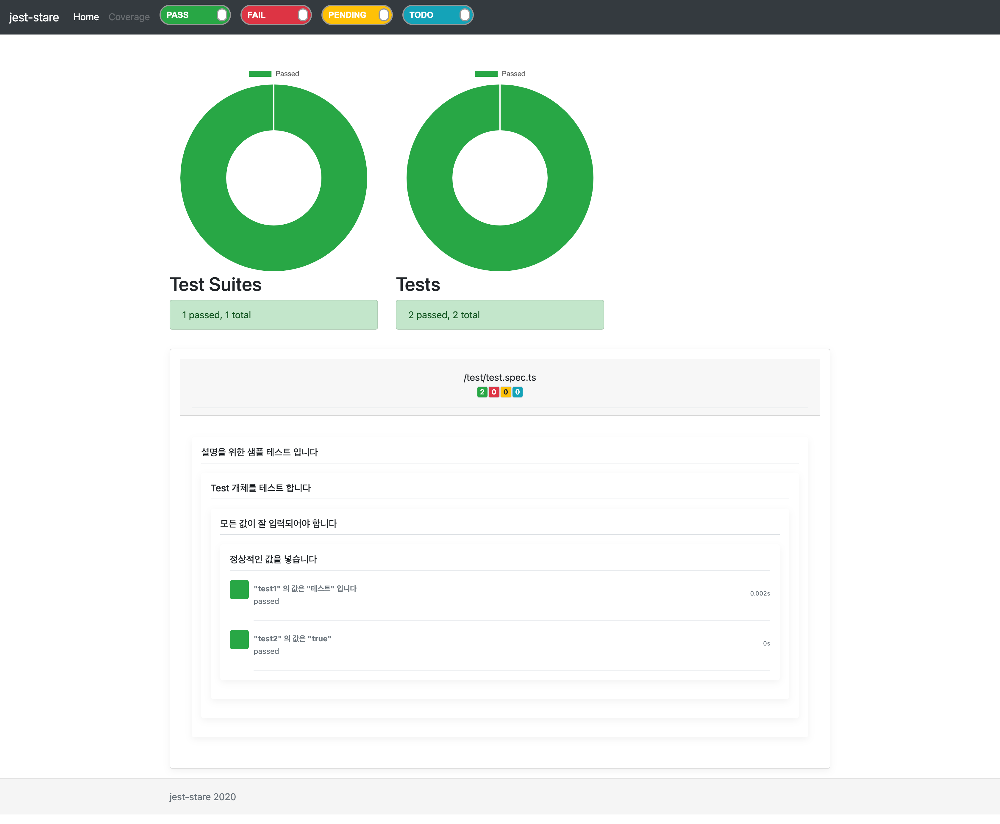

# Jest Report Sample

## Quick Start

* install package
  ```sh
  $ npm i
  ```
* run `test`
  ```sh
  $ npm test
  ```
* open `report`
  ```sh
  open jest-stare/index.html 
  ```



> more information
>
> @see [jest stare](https://github.com/dkelosky/jest-stare)